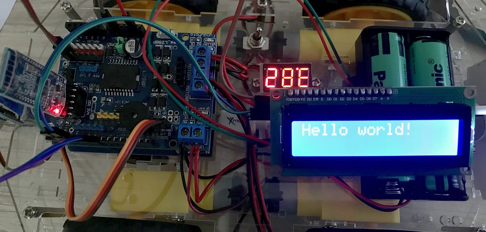

# 1602 display on I2C

The I2C bus only needs 2 pins or wires and we can connect more than a dozen sensors and displays to it! The gyroscope on he MPU is already connected to I2C, so we can easily add a display.

The general driver for these displays is [HD44780](https://en.wikipedia.org/wiki/Hitachi_HD44780_LCD_controller) from Hitachi. Include the library in the Arduino IDE by 'Sketch - Include Library > Manage Libraries...' and search for 44780. Add the library from Bill Perry since it includes the I2C expander backpack.

### Hello world

The code for 'Hello world!' is relatively simple afterwards:

```c
#include <Wire.h>
#include <hd44780.h>
#include <hd44780ioClass/hd44780_I2Cexp.h> // for I2C expander

hd44780_I2Cexp lcd; // declare lcd object:

void setup() {
  lcd.begin(16, 2);
  lcd.print("Hello world!");  
}

void loop() {
}
```

And the output is:



### Bluetooth incomming

Bluetooth is connected to pin 0 and 1 and can be accessed by Serial1.
